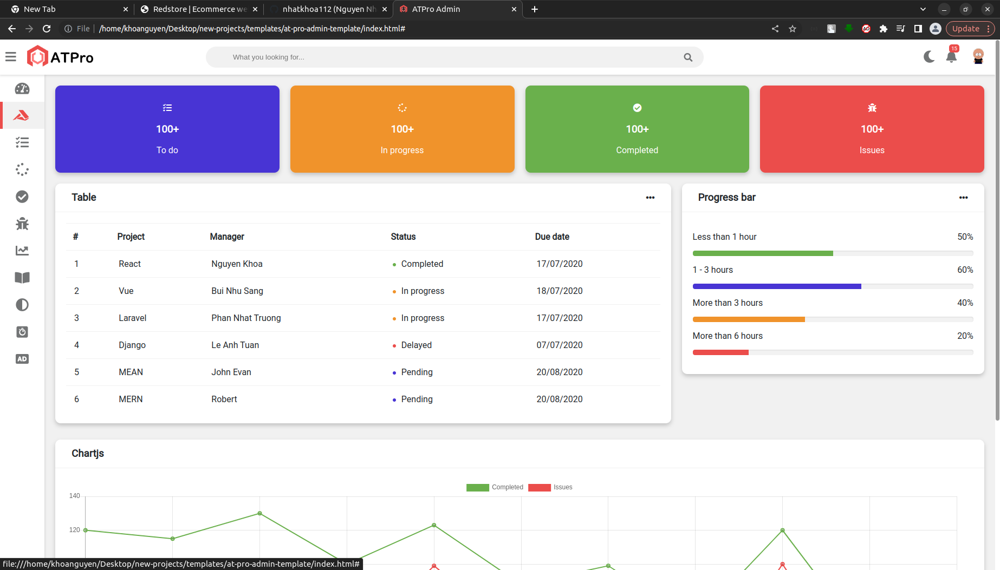
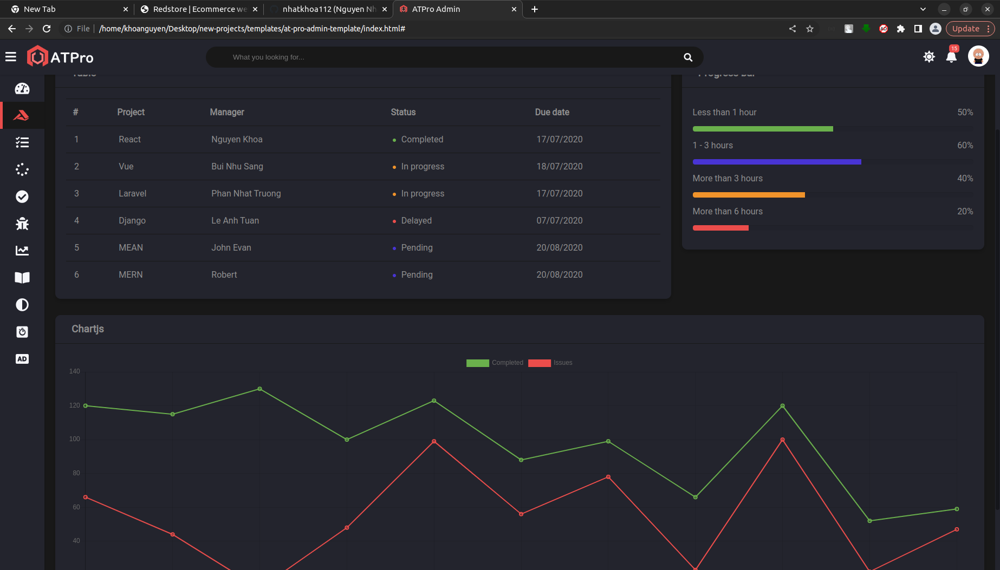

# ATPro admin template  HTML + CSS + JS

ATPro is a fully responsive administration template. Based on pure HTML, CSS and JS. Customizable and easy to use. Fits many screen resolutions from small mobile devices to large desktops.

## Preview

	

## Contributing

1. Fork it!
2. Create your feature branch: `git checkout -b your-new-feature`
3. Commit your changes: `git commit -am 'Add some feature'`
4. Push to the branch: `git push origin your-new-feature`
5. Submit a pull request

